# 🖨️ SxS PDF Generator

A Streamlit web app that generates standardized PDF documents for side-by-side LLM model comparisons, with automated Google Sheets integration.

• **Designed for AIT Inv agents working on Google's Chiron EDU project for SxS human evaluations.**

---

## 🏗️ Architecture

```mermaid
graph TD
    A[👤 User Upload] --> B[🖥️ Streamlit App]
    B --> C[📄 PDF Generator]
    C --> E[🔗 Apps Script API] --> D
    D[☁️ Google Drive] --> F[📊 Google Sheets]
    
    
    style A fill:#e1f5fe,stroke:#01579b,stroke-width:2px
    style B fill:#4285f4,color:#fff,stroke:#1565c0,stroke-width:3px
    style C fill:#f3e5f5,stroke:#7b1fa2,stroke-width:2px
    style D fill:#e8f5e8,stroke:#2e7d32,stroke-width:2px
    style E fill:#fff3e0,stroke:#ef6c00,stroke-width:2px
    style F fill:#e8f5e8,stroke:#2e7d32,stroke-width:2px
```



---

## </> Features

| Feature | Description |
|---------|-------------|
| 🎯 **Image Reordering** | Drag-and-drop interface for eval screenshots organization |
| 📋 **Standardized PDFs** | Google Slides 16:9 format with company branding |
| 🔄 **Automated Integration** | Direct upload to Google Drive and Sheets logging |
| 🔒 **Secure Workflow** | Anti-exploitation protection with session locking |
| ✅ **Validation** | Authorized user and LLM combo verification with fallback support |

---

## 🚀 Quick Start

```bash
# 1. Configure
inside .streamlit/secrets.toml > "webhook_url = 'your-apps-script-url'"

# 2. Install dependencies
pip install -r requirements.txt

# 3. Run locally
streamlit run sxs_pdf_generator.py
```

### Better yet: **Deploy to Streamlit Cloud** → Navigate through the 4-step guided workflow

---

## 🛠️ Tech Stack

<div align="center">

| Component | Technology | Purpose |
|-----------|------------|---------|
| **Frontend** | Streamlit + Custom CSS | User interface and styling |
| **PDF Engine** | ReportLab + PIL | Document generation and image processing |
| **Integration** | Google Apps Script API | Webhook-based backend services |
| **Security** | Session-based locks | Input validation and anti-exploitation |

</div>

---

## 📊 Workflow Steps

```mermaid
flowchart LR
    Step1[1️⃣ Metadata Input] --> Step2[2️⃣ Image Upload]
    Step2 --> Step3[3️⃣ PDF Generation]
    Step3 --> Step4[4️⃣ Upload & Submit]
    
    style Step1 fill:#e3f2fd,stroke:#1976d2
    style Step2 fill:#f3e5f5,stroke:#7b1fa2
    style Step3 fill:#e8f5e8,stroke:#388e3c
    style Step4 fill:#fff3e0,stroke:#f57c00
```



---

<div align="center">

**Production v2** • **Chiron EDU** • **FA**


</div>
